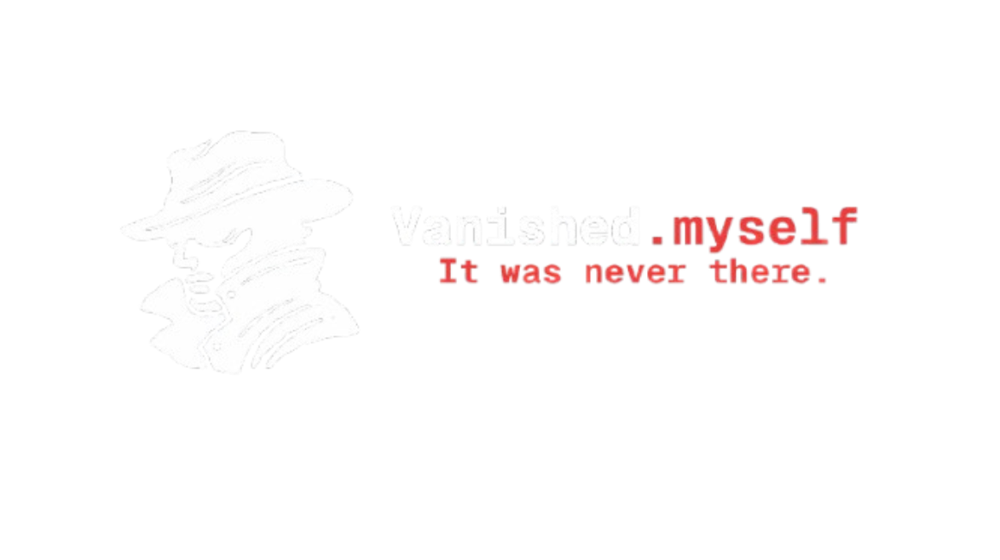

  

# vanishing.persona.

A local, privacy-first automation tool to bulk delete posts, tweets, and messages across multiple platforms.

Currently, the app doesn't have a core, this repo is just the starting point. The main goal is to build a tool that handles data deletion entirely locally, meaning no cloud storage for API keys and no external tracking.

## TODOs / Development Checklist

Right now we just need to get the core architecture up and running before we move on to the actual platform integrations.

### Core Architecture
- [x] Tech stack chosen: Sciter for UI
- [x] Secure local storage chosen: Encrypted JSON for API keys
- [ ] Build the core job queue to handle bulk tasks and rate limits

### Platform Integrations
- [ ] Build local-only OAuth flows
- [ ] Twitter/X API integration (fetch and delete tweets/likes)
- [ ] Reddit API integration (fetch and delete comments/posts)
- [ ] Discord integration (delete DMs and server messages)

### UI / Front-end
- [ ] Basic dashboard for connecting platform accounts
- [ ] Post filtering view (by date, keywords, engagement)
- [ ] Progress tracker for active deletion queues

### Security & Release
- [ ] Local security review (ensure zero data leakage)
- [ ] Write instructions on how users can generate their own API keys
- [ ] Build standalone executables (Windows/macOS/Linux)
